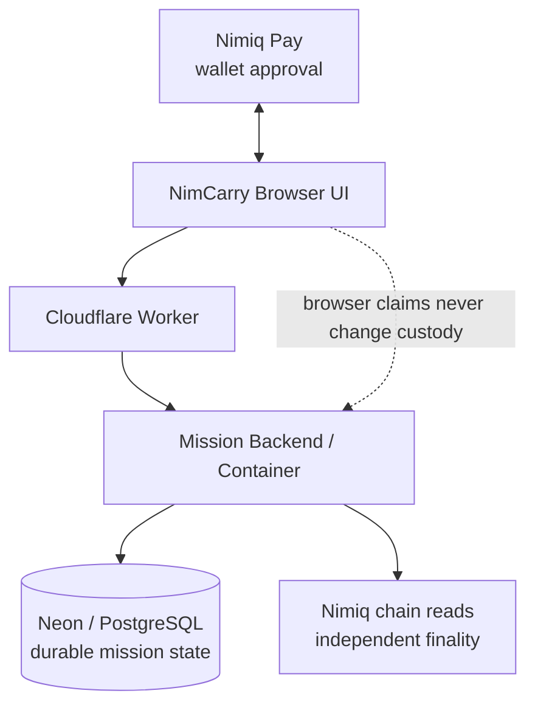

<p align="center">
  
</p>

<h1 align="center">NimCarry</h1>

<p align="center"><strong>A private introduction, carried by people.</strong></p>
<p align="center">Get introduced to someone you cannot reach directly — one consenting human carrier at a time.</p>

<p align="center">
  <a href="https://nimcarry.faadil-casecraft.workers.dev"><strong>Live App</strong></a>
  ·
  <a href="https://nimcarry.faadil-casecraft.workers.dev/?demo=1&tour=1&reset=1"><strong>Guided Demo</strong></a>
  ·
  <a href="https://youtu.be/SAyv8hyZG6Q"><strong>Demo Video</strong></a>
  ·
  <a href="https://github.com/Faadil1/nimcarry/releases/tag/v1.0.0"><strong>v1.0.0 Release</strong></a>
</p>

<p align="center"><sub>Cycle II Public Preview · Testnet · Mainnet disabled</sub></p>

> **Current status**  
> The live product and deterministic guided demo are available. Native Nimiq Pay TESTNET transfer has been proven independently, and NimCarry now includes an explicit read-only TESTNET preflight plus HTLC-aware sender verification. A fresh end-to-end NimCarry A→B→C TESTNET run after those corrections is still pending, so no real NimCarry `FINAL` or `ARRIVED` is claimed yet.

<p align="center">
  
</p>

## Why NimCarry exists

### The pain

**Warm introductions disappear after the first handoff.** Someone you trust says “I’ll pass it on,” and from that moment the route becomes invisible.

### The problem

Once an introduction moves beyond the first person, the creator usually cannot reliably know:

- who currently carries it;
- whether the next person explicitly consented;
- whether the handoff actually happened;
- whether the route is still moving toward the intended destination;
- when the intended destination has actually been reached.

A message can prove that someone *said* they forwarded something. It does not create shared custody state.

### Why NimCarry is different

NimCarry turns that informal chain into a **private introduction carried hand-to-hand**. The product's V2 interaction model is **The Carried Letter**: the mission is the letter, the 1 NIM baton is its custody seal, warm wax represents pre-FINAL verification, and a postmark appears only when independent FINAL proof changes the holder.

- Exactly **1 NIM** acts as the custody baton — not a reward, wager, stake, or prize.
- A bridge explicitly accepts before custody can move.
- Wallet approval, a pending transaction, or a browser claim never advances the route.
- Only independently verified `FINAL` changes custody.
- The destination stays protected while the route remains understandable.
- When the destination becomes the finalized recipient, NimCarry produces a privacy-safe **Carried Letter Receipt**.

**Create → Invite → Accept → Pass 1 NIM → FINAL → Next bridge → ARRIVED**

Without Nimiq, a bridge can only say “I forwarded it.” With NimCarry, the handoff can become a verifiable custody event.

---

## The route

| Step | What happens |
|---|---|
| Mission Home | See who holds the letter and the verified human route |
| Write the letter | Define one known destination and the human reason it should reach them |
| Private invitation | One chosen carrier explicitly accepts or declines |
| Seal & pass 1 NIM | The current holder authorizes the exact custody-seal transfer |
| Warm wax → postmark | Approval/reference/pending stay pre-FINAL; only FINAL changes the holder |
| Arrival | The intended destination opens the letter and receives the privacy-safe receipt |

<p align="center">
  
</p>

The product story is simple: **I need to reach someone I cannot contact directly. I ask someone I trust to bridge the mission. They choose whether to accept. If they do, 1 NIM becomes the baton. The route moves only after verified finality.**

---

## Execution

NimCarry separates user approval, mission state, durable storage, and chain verification so that no browser claim can move custody by itself.



- **Nimiq Pay / Mini App SDK** handles the wallet session, explicit approval, and transaction submission path.
- **NimCarry frontend** provides the five-screen mission experience and scoped route navigation.
- **TypeScript / Node mission service** enforces invitation, authorization, pass-intent, retry, reconciliation, and finality rules.
- **Cloudflare Worker + Container** provides the production frontend and backend through one origin.
- **Neon / PostgreSQL** stores missions, invitations, pass intents, audit data, participants, and finalized hops.
- **Independent Nimiq chain reads** verify transaction and finality evidence instead of trusting wallet callbacks.
- **Cryptographic target protection** keeps the destination encrypted and uses an opaque `co:v1:` commitment rather than clear-text mission identifiers.

For the compact technical map, see [`docs/ARCHITECTURE.md`](docs/ARCHITECTURE.md).

---

## Evidence

What is proven today:

- A complete five-screen destination-bound routing flow.
- Explicit bridge consent before any payment.
- Exactly **1 NIM = one custody baton**.
- FINAL-only custody transitions.
- Privacy-safe destination handling and opaque on-chain commitments.
- Fail-closed behavior for expired invites, stale intents, lost capabilities, and ambiguous broadcasts.
- Production Cloudflare + Container + Neon/PostgreSQL runtime.
- Live Nimiq Pay provider readiness proven on a real device.
- A native Nimiq Pay TESTNET transfer independently confirmed on-chain.
- Read-only TESTNET preflight proving wallet/provider and NimCarry network alignment without writes.
- HTLC-aware transaction verification so the human identity does not have to equal the raw on-chain `tx.from`.
- Deterministic guided demo ending in a privacy-safe Carried Letter Receipt.
- The Carried Letter V2 gates are protected by CI plus mobile/desktop guided-flow smoke.
- `v1.0.0 — Cycle II Preview` published.

| Area | Status |
|---|---|
| Live production app | Available |
| Deterministic guided demo | Ready |
| Cloudflare / Postgres runtime | Ready |
| Nimiq Pay provider readiness | Verified |
| Native Nimiq Pay TESTNET transfer | Verified on-chain |
| NimCarry TESTNET network preflight | PASS / read-only |
| HTLC-aware sender verification | Implemented |
| Fresh NimCarry A→B→C TESTNET FINAL run | Pending |
| Real NimCarry FINAL / ARRIVED | Not claimed |
| Mainnet | Disabled |

The strongest production statement is also the most important evidence boundary: **approval ≠ provider reference ≠ independent verification ≠ FINAL**.

Earlier controlled attempts failed closed and did not move custody. Later investigation uncovered two integration realities that changed the diagnosis: Nimiq Pay itself had to be explicitly aligned to TESTNET, and outgoing Nimiq Pay transfers can use an HTLC payment rail whose on-chain sender differs from the human/basic account identity. NimCarry now checks both realities directly instead of attributing the earlier failures to an unconfirmed provider regression.

---

## Demo

The recommended judge path is the deterministic [Guided Demo](https://nimcarry.faadil-casecraft.workers.dev/?demo=1&tour=1&reset=1). It uses the real product UI/state model but is permanently marked **PRACTICE** and performs no wallet or network writes. It is presentation evidence, not a claim of real TESTNET finality.

**Watch the final 84-second demo:** [NimCarry — One NIM. One Bridge at a Time.](https://youtu.be/SAyv8hyZG6Q)

<p align="center">
  
</p>
<p align="center"><em>Guided Demo — simulated ARRIVED / Route Receipt. Presentation only; not real TESTNET finality evidence.</em></p>

The final demo video pairs a short cinematic interpretation of the custody baton with real NimCarry screens; the cinematic layer is storytelling, while the live product remains the proof.

---

## Engineering challenges

### Reissuing an expired invitation without weakening invariants

The first recovery path tried to create another invitation for the same mission sequence and hit a duplicate-key constraint. Instead of weakening the database rule, NimCarry now reissues the same row, rotates the private token, invalidates the old capability, and preserves the sequence invariant.

### Keeping private route access intact during navigation

The Pass 1 NIM screen initially failed closed with `ROUTE_VIEW_CAPABILITY_REQUIRED` because direct navigation lost the scoped route-view capability. The fix preserved that capability through internal navigation rather than making missions public.

### Treating retries as security logic

After a failed wallet attempt, a stale pass intent remained. NimCarry now reuses a valid intent, renews a stale one only when it is definitely unbroadcast, and refuses renewal if any broadcast evidence exists.

### Refusing to confuse approval with proof

Controlled attempts taught the product to separate four different facts: wallet authorization, a provider-returned transaction reference, independent chain observation, and FINAL. NimCarry keeps custody at the last verified holder through every pre-FINAL state.

### Aligning the wallet and product to the same network

During testing, NimCarry's TESTNET expectation and the wallet's actual network were not always the same. The fix was not another label: NimCarry now has a read-only preflight that checks provider readiness and TESTNET alignment before a controlled transactional gate.

### Identity is not necessarily `tx.from`

A successful native TESTNET transfer showed that Nimiq Pay can route outgoing value through an HTLC payment rail. The human/basic Nimiq Pay identity therefore does not have to be the raw transaction sender. NimCarry's verifier now allows an HTLC sender only when independent chain evidence links that rail to the authorized holder, while preserving the exact recipient, exactly 1 NIM, opaque commitment and FINAL requirements.

### Current real-proof boundary

The corrected integration has not yet completed a fresh NimCarry A→B→C TESTNET route all the way to real `FINAL` / `ARRIVED`. Until that happens, the guided demo stays explicitly simulated and the repository makes no real-arrival claim.

---

## Security model

- Nimiq wallet signatures authorize holder-sensitive actions.
- Target wallets are encrypted with AES-256-GCM and matched at arrival with a separate keyed HMAC-SHA256.
- Pass intents require opaque `co:v1:<commitment>` recipient data.
- The client requests exactly `100000` Luna with requested fee `0`; the backend independently verifies the authorized holder, the allowed direct/HTLC sender relationship, the intended recipient, opaque commitment and finalized chain evidence.
- Route-view and broadcast capabilities are scoped and short-lived.
- Infrastructure uncertainty surfaces as delayed verification, never as a false custody change.

See [`SECURITY.md`](SECURITY.md) for release boundaries and vulnerability reporting.

---

## Repository guide

The public `main` branch is intentionally compact for judges and contributors:

- `web/` — browser Mini App and guided demo
- `src/` — mission, Nimiq, persistence, and service logic
- `tests/` — deterministic unit/integration coverage
- `migrations/` — PostgreSQL schema and concurrency guards
- `cloudflare/` — production Worker / Container runtime
- `docs/` — concise architecture, release, submission, and README assets
- `scripts/` — local development, smoke, migration, and safety utilities

Internal research, strategy notes, transcript analysis, judge Q&A, and operational handovers are intentionally not part of the current public tree.

---

## Development

```bash
npm ci
npm run typecheck
npm test
npm run build
```

## Team

- **Faadil Boussari** — product / repo lead
- **Opeyemi (`opeblow`)** — collaborator / technical lead

## Useful links

- [Live App](https://nimcarry.faadil-casecraft.workers.dev)
- [Guided Demo](https://nimcarry.faadil-casecraft.workers.dev/?demo=1&tour=1&reset=1)
- [Demo Video](https://youtu.be/SAyv8hyZG6Q)
- [Architecture](docs/ARCHITECTURE.md)
- [Security](SECURITY.md)
- [Release notes](docs/release/RELEASE-NOTES-V1.0.0.md)
- [v1.0.0 release](https://github.com/Faadil1/nimcarry/releases/tag/v1.0.0)

## License

MIT — see [`LICENSE`](LICENSE).
