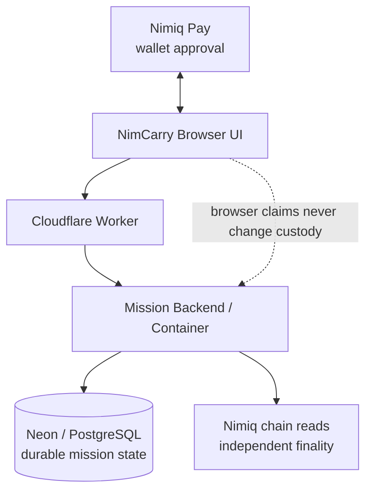

<p align="center">
  
</p>

<h1 align="center">NimCarry</h1>

<p align="center"><strong>One NIM. One bridge at a time.</strong></p>
<p align="center">Get this to someone you cannot reach directly — one human bridge at a time.</p>

<p align="center">
  <a href="https://nimcarry.faadil-casecraft.workers.dev"><strong>Live App</strong></a>
  ·
  <a href="https://nimcarry.faadil-casecraft.workers.dev/?demo=1"><strong>Guided Demo</strong></a>
  ·
  <a href="https://youtu.be/SAyv8hyZG6Q"><strong>Demo Video</strong></a>
  ·
  <a href="https://nimcarry.faadil-casecraft.workers.dev/usage.html"><strong>Live Usage Evidence</strong></a>
  ·
  <a href="https://github.com/Faadil1/nimcarry/releases/tag/v1.0.0"><strong>v1.0.0 Release</strong></a>
</p>

<p align="center"><sub>Cycle II Public Preview · Testnet · Mainnet disabled</sub></p>

> **Current status**  
> The live product and guided demo are available now. Real A→B→C TESTNET proof is still pending because two approved attempts were independently verified as not broadcast. The suspected Nimiq Pay 2.19.1 TESTNET submission issue remains unconfirmed. No real `FINAL` or `ARRIVED` is claimed.

<p align="center">
  
</p>

## Why NimCarry exists

### The pain

**Warm introductions disappear after the first handoff.** Someone you trust says “I’ll pass it on,” and from that moment the route becomes invisible.

### The problem

Once an introduction moves beyond the first person, the creator usually cannot reliably know:

- who currently carries it;
- whether the next person explicitly consented;
- whether the handoff actually happened;
- whether the route is still moving toward the intended destination;
- when the intended destination has actually been reached.

A message can prove that someone *said* they forwarded something. It does not create shared custody state.

### Why NimCarry is different

NimCarry turns that informal chain into a **destination-bound human route**.

- Exactly **1 NIM** acts as the custody baton — not a reward, wager, stake, or prize.
- A bridge explicitly accepts before custody can move.
- Wallet approval, a pending transaction, or a browser claim never advances the route.
- Only independently verified `FINAL` changes custody.
- The destination stays protected while the route remains understandable.
- When the destination becomes the finalized recipient, NimCarry produces a privacy-safe **Route Receipt**.

**Create → Invite → Accept → Pass 1 NIM → FINAL → Next bridge → ARRIVED**

Without Nimiq, a bridge can only say “I forwarded it.” With NimCarry, the handoff can become a verifiable custody event.

---

## The route

| Step | What happens |
|---|---|
| Mission Home | See the destination-bound mission and verified route |
| Create Mission | Define the known destination and purpose |
| Bridge Invitation | A chosen bridge explicitly accepts before payment |
| Pass 1 NIM | The current holder approves the exact baton transfer |
| Route / Arrival | Only finalized hops appear; ARRIVED produces the receipt |

<p align="center">
  
</p>

The product story is simple: **I need to reach someone I cannot contact directly. I ask someone I trust to bridge the mission. They choose whether to accept. If they do, 1 NIM becomes the baton. The route moves only after verified finality.**

---

## Execution

NimCarry separates user approval, mission state, durable storage, and chain verification so that no browser claim can move custody by itself.



- **Nimiq Pay / Mini App SDK** handles the wallet session, explicit approval, and transaction submission path.
- **NimCarry frontend** provides the five-screen mission experience and scoped route navigation.
- **TypeScript / Node mission service** enforces invitation, authorization, pass-intent, retry, reconciliation, and finality rules.
- **Cloudflare Worker + Container** provides the production frontend and backend through one origin.
- **Neon / PostgreSQL** stores missions, invitations, pass intents, audit data, participants, and finalized hops.
- **Independent Nimiq chain reads** verify transaction and finality evidence instead of trusting wallet callbacks.
- **Cryptographic target protection** keeps the destination encrypted and uses an opaque `co:v1:` commitment rather than clear-text mission identifiers.

For the compact technical map, see [`docs/ARCHITECTURE.md`](docs/ARCHITECTURE.md).

---

## Evidence

What is proven today:

- A complete five-screen destination-bound routing flow.
- Explicit bridge consent before any payment.
- Exactly **1 NIM = one custody baton**.
- FINAL-only custody transitions.
- Privacy-safe destination handling and opaque on-chain commitments.
- Fail-closed behavior for expired invites, stale intents, lost capabilities, and ambiguous broadcasts.
- Production Cloudflare + Container + Neon/PostgreSQL runtime.
- Live Nimiq Pay provider readiness proven on a real device.
- Deterministic guided demo ending in a privacy-safe Route Receipt.
- `v1.0.0 — Cycle II Preview` published.
- 176/176 automated tests passing at the V1 release and production judge smoke 5/5 passing.

| Area | Status |
|---|---|
| Live production app | Ready |
| Guided demo | Ready |
| Cloudflare / Postgres runtime | Ready |
| Nimiq Pay provider readiness | Verified |
| Real A→B TESTNET broadcast | Blocked before broadcast |
| Real FINAL / ARRIVED | Not claimed |
| Mainnet | Disabled |

The strongest production statement is also the most important evidence boundary: **approval ≠ broadcast ≠ FINAL**.

Two controlled A→B attempts reached native Nimiq Pay approval and failed afterward. We independently checked chain history, recipient balance, backend intent state, and Neon finality state. Both attempts were classified `NOT_BROADCAST`; NimCarry did not move custody or manufacture ARRIVED.

### Real usage — privacy-safe and judge-verifiable

NimCarry now keeps **human registration**, **verified Nimiq wallet linking**, and **protocol participation** as separate evidence classes. This prevents development/test protocol rows from being presented as real-user traction.

Production snapshot captured **2026-09-19 11:57:03 UTC**:

| Metric | Snapshot | Meaning |
|---|---:|---|
| Registered human profiles | **27** | Distinct voluntary profiles stored in production |
| Profiles with recorded privacy consent | **27** | Current Privacy Notice version + consent timestamp recorded |
| Wallet-linked registered users | **0** | Requires a real Nimiq wallet signature |
| Registered protocol participants | **0** | Requires a verified linked wallet that appears in protocol participation |

The earlier protocol test state remains separate: **7 participation rows across 3 distinct wallets** existed before the human registry and is **not counted as registered-user traction**.

Judges can verify current aggregate counts without access to personal data:

- [Live usage evidence page](https://nimcarry.faadil-casecraft.workers.dev/usage.html)
- [Aggregate user JSON](https://nimcarry.faadil-casecraft.workers.dev/users/stats)
- [Protocol runtime aggregate JSON](https://nimcarry.faadil-casecraft.workers.dev/usage)
- [Timestamped repository snapshot](docs/evidence/real-usage-2026-09-19.json)

No screenshot containing a user's name or email is published as usage evidence. The public evidence surface exposes aggregate counts only.

---

## Demo

The recommended judge path is the deterministic [Guided Demo](https://nimcarry.faadil-casecraft.workers.dev/?demo=1). It uses the real product UI and state model without requiring wallet or network writes while the TESTNET submission issue remains unresolved.

**Watch the final 84-second demo:** [NimCarry — One NIM. One Bridge at a Time.](https://youtu.be/SAyv8hyZG6Q)

<p align="center">
  
</p>
<p align="center"><em>Guided Demo — simulated ARRIVED / Route Receipt. Presentation only; not real TESTNET finality evidence.</em></p>

The final demo video pairs a short cinematic interpretation of the custody baton with real NimCarry screens; the cinematic layer is storytelling, while the live product remains the proof.

---

## Engineering challenges

### Reissuing an expired invitation without weakening invariants

The first recovery path tried to create another invitation for the same mission sequence and hit a duplicate-key constraint. Instead of weakening the database rule, NimCarry now reissues the same row, rotates the private token, invalidates the old capability, and preserves the sequence invariant.

### Keeping private route access intact during navigation

The Pass 1 NIM screen initially failed closed with `ROUTE_VIEW_CAPABILITY_REQUIRED` because direct navigation lost the scoped route-view capability. The fix preserved that capability through internal navigation rather than making missions public.

### Treating retries as security logic

After a failed wallet attempt, a stale pass intent remained. NimCarry now reuses a valid intent, renews a stale one only when it is definitely unbroadcast, and refuses renewal if any broadcast evidence exists.

### Refusing to confuse approval with proof

Two controlled A→B attempts reached the native Nimiq Pay approval screen and failed afterward. NimCarry kept custody at the last verified holder and classified both attempts `NOT_BROADCAST` after independent checks.

### Current TESTNET limitation

Provider initialization, account access, consensus, block height, recipient presence, value, fee, and payload size all passed validation. Wallet approval opens, but no transaction hash returns. The current classification remains:

`LIKELY_EXTERNAL_NIMIQ_PAY_TESTNET_SUBMISSION_REGRESSION_NOT_YET_CONFIRMED`

NimCarry does not claim that Nimiq has officially confirmed the cause.

---

## Security model

- Nimiq wallet signatures authorize holder-sensitive actions.
- Target wallets are encrypted with AES-256-GCM and matched at arrival with a separate keyed HMAC-SHA256.
- Pass intents require opaque `co:v1:<commitment>` recipient data.
- The client requests exactly `100000` Luna with requested fee `0`; the backend independently verifies sender and finalized chain evidence.
- Route-view and broadcast capabilities are scoped and short-lived.
- Infrastructure uncertainty surfaces as delayed verification, never as a false custody change.

See [`SECURITY.md`](SECURITY.md) for release boundaries and vulnerability reporting.

---

## Repository guide

The public `main` branch is intentionally compact for judges and contributors:

- `web/` — browser Mini App and guided demo
- `src/` — mission, Nimiq, persistence, and service logic
- `tests/` — deterministic unit/integration coverage
- `migrations/` — PostgreSQL schema and concurrency guards
- `cloudflare/` — production Worker / Container runtime
- `docs/` — concise architecture, release, submission, and README assets
- `scripts/` — local development, smoke, migration, and safety utilities

Internal research, strategy notes, transcript analysis, judge Q&A, and operational handovers are intentionally not part of the current public tree.

---

## Development

```bash
npm ci
npm run typecheck
npm test
npm run build
```

## Team

- **Faadil Boussari** — product / repo lead
- **Opeyemi (`opeblow`)** — collaborator / technical lead

## Useful links

- [Live App](https://nimcarry.faadil-casecraft.workers.dev)
- [Guided Demo](https://nimcarry.faadil-casecraft.workers.dev/?demo=1)
- [Demo Video](https://youtu.be/SAyv8hyZG6Q)
- [Live usage evidence](https://nimcarry.faadil-casecraft.workers.dev/usage.html)
- [Real usage snapshot](docs/evidence/real-usage-2026-09-19.json)
- [Architecture](docs/ARCHITECTURE.md)
- [Security](SECURITY.md)
- [Release notes](docs/release/RELEASE-NOTES-V1.0.0.md)
- [v1.0.0 release](https://github.com/Faadil1/nimcarry/releases/tag/v1.0.0)

## License

MIT — see [`LICENSE`](LICENSE).
