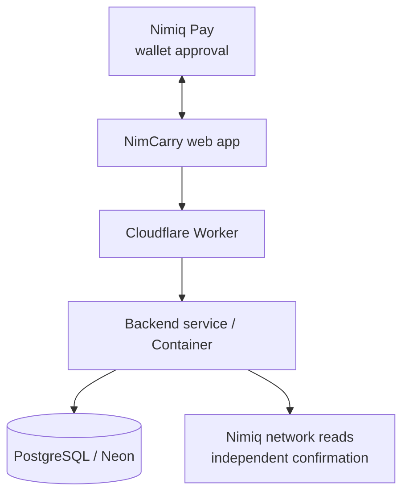

<p align="center">
  
</p>

<h1 align="center">NimCarry</h1>

<p align="center"><strong>Send NIM to someone, even without their wallet address.</strong></p>
<p align="center">You share a private link. They choose their own wallet. You see when it has arrived.</p>

<p align="center">
  <a href="https://nimcarry.faadil-casecraft.workers.dev"><strong>Live App</strong></a>
  ·
  <a href="https://nimcarry.faadil-casecraft.workers.dev/?demo=1"><strong>Practice Mode</strong></a>
  ·
  <a href="https://youtu.be/SAyv8hyZG6Q"><strong>Demo Video</strong></a>
  ·
  <a href="https://nimcarry.faadil-casecraft.workers.dev/real-usage"><strong>Live Usage</strong></a>
</p>

<p align="center"><sub>Nimiq Pay Mini App · Cycle II · Testnet only</sub></p>

## The problem

You want to send NIM to someone, but you don't have their wallet address. Today that means a back-and-forth in chat ("what's your address?"), a copy-paste you can get wrong, and no clear moment where you both know the money has arrived.

## How NimCarry works

1. **Name them.** Type who it's for and a short note. Their address is optional.
2. **Share the link.** NimCarry gives you a private, expiring link. Send it however you like.
3. **They open it.** They choose the Nimiq wallet where they want to receive. It's locked in: you can't be tricked into paying another address.
4. **You send.** You approve the payment in Nimiq Pay. It goes straight to their wallet.
5. **Arrived.** NimCarry checks the Nimiq network itself and tells you when the payment is confirmed. You can close the app in the meantime.

If you already know their address, you can skip the link and send directly.

**Optional:** if you can't reach the person yourself, you can ask someone you both know to introduce you. They accept with one tap. The NIM still goes straight from you to the recipient; the introducer never holds it.

## Why it's safe

- **Only the right person can use the link.** Links are private, single-use and expire. Creating a new one cancels the old one.
- **No double payment.** Once a payment is sent, NimCarry blocks a second send, even if the app is closed or the wallet response gets lost.
- **"Sent" means confirmed.** A wallet approval is not treated as proof. NimCarry marks a payment as arrived only after it is confirmed on the Nimiq network.
- **The recipient's address stays private.** It is stored encrypted and never shown to anyone else.

## Status: honest numbers

NimCarry is a public preview on **Testnet**. Mainnet is disabled.

Production snapshot, 2026-09-19:

| | Count |
|---|---:|
| Registered profiles | 27 |
| Users with a verified Nimiq wallet | 0 |
| Users who created or completed a payment after verifying | 0 |

We count only activity that can be verified on Nimiq, and old test activity is excluded. The numbers are live on the [usage page](https://nimcarry.faadil-casecraft.workers.dev/real-usage) ([JSON](https://nimcarry.faadil-casecraft.workers.dev/users/stats)); the counting rules are in [Real Usage Assurance v2](docs/evidence/REAL-USAGE-ASSURANCE-V2.md).

**Known issue:** on Testnet, Nimiq Pay sometimes approves a payment without returning a transaction reference to the app. NimCarry handles this safely (it waits, searches the network, and never re-sends), but it can delay confirmation. The investigation is public in [nimiq/wallet#314](https://github.com/nimiq/wallet/issues/314).

## Try it

- **[Practice mode](https://nimcarry.faadil-casecraft.workers.dev/?demo=1&tour=1&reset=1)** runs the real interface with simulated payments: write the link, open it as the recipient, drag the seal to send, see it arrive. No wallet needed, nothing is sent.
- **[Live app](https://nimcarry.faadil-casecraft.workers.dev)**: open it inside Nimiq Pay (Testnet) to send a real Testnet payment link.
- **[84-second video](https://youtu.be/SAyv8hyZG6Q)**

---

## For developers

### Architecture



- **Frontend** (`web/`): the Mini App, using the Nimiq Mini App SDK for wallet approvals. One stylesheet (`nimcarry.css`), self-hosted fonts, and a shared UI module (`nc-ui.js`) for the letter, the wax seal and the drag-to-send gesture.
- **Backend** (`src/`, TypeScript/Node): links, payment intents, retries and confirmation checks.
- **Storage** (`migrations/`): PostgreSQL on Neon, with database-level guards against duplicate payments.
- **Hosting** (`cloudflare/`): one Cloudflare Worker + Container origin.
- **Sign-in**: name + email profile, recovered with a 6-digit email code. Email never authorizes a payment; only a Nimiq wallet signature does.

More detail: [Architecture](docs/ARCHITECTURE.md) · [Approval Is Not Final](docs/APPROVAL-IS-NOT-FINAL.md) (the pattern we use for uncertain wallet responses) · [Security](SECURITY.md).

### Security details

- Recipient wallets are encrypted with AES-256-GCM and matched with a separate keyed HMAC-SHA256.
- Payment requests carry an opaque `co:v1:` commitment instead of readable identifiers.
- The client requests exactly 1 NIM (100,000 Luna) with fee 0; the backend independently verifies the sender and the confirmed on-chain transaction.
- Email codes expire after 10 minutes, are stored hashed, are single-use and lock after repeated failures.
- Access tokens for viewing a payment are scoped and short-lived.

### Run it locally

```bash
npm ci
npm run typecheck
npm test
npm run build
```

Email sign-in in production needs `RESEND_API_KEY` and a verified `NIMCARRY_EMAIL_FROM`. Without them, the endpoint refuses rather than pretending a code was sent.

### Repository

- `web/` — Mini App and practice mode
- `src/` — backend, Nimiq integration, persistence
- `tests/` — unit and integration tests
- `migrations/` — database schema
- `cloudflare/` — production runtime
- `docs/` — architecture, evidence, release notes
- `docs/internal/` — team working notes (handovers, hypotheses, submission material)

## Team

- **Faadil Boussari** — product / repo lead
- **Opeyemi (`opeblow`)** — collaborator / technical lead

## License

MIT — see [`LICENSE`](LICENSE).
