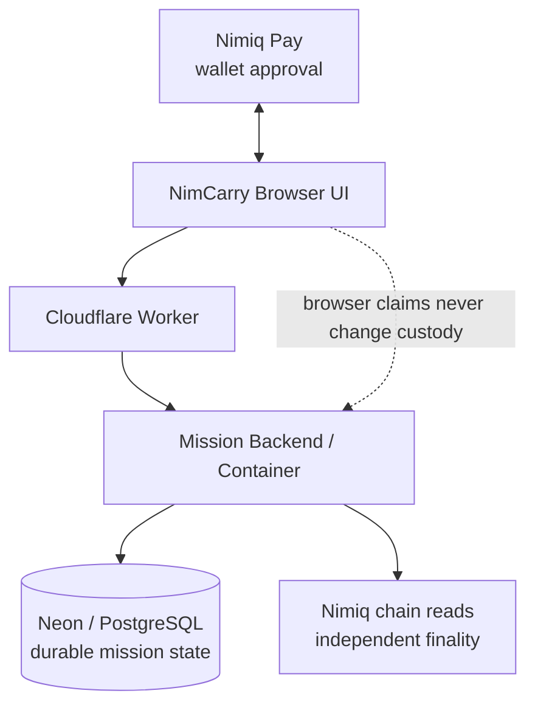

<p align="center">
  
</p>

<h1 align="center">NimCarry</h1>

<p align="center"><strong>One NIM. One bridge at a time.</strong></p>
<p align="center">Get this to someone you cannot reach directly — one human bridge at a time.</p>

<p align="center">
  <a href="https://nimcarry.faadil-casecraft.workers.dev"><strong>Live App</strong></a>
  ·
  <a href="https://nimcarry.faadil-casecraft.workers.dev/?demo=1"><strong>Guided Demo</strong></a>
  ·
  <a href="https://github.com/Faadil1/nimcarry/releases/tag/v1.0.0"><strong>v1.0.0 Release</strong></a>
</p>

> **Cycle II Public Preview · Testnet · Mainnet disabled**
>
> The demo is available now. Real A→B→C TESTNET proof remains blocked by a likely external, not-yet-confirmed Nimiq Pay 2.19.1 post-approval submission issue. No real `FINAL` or `ARRIVED` has occurred.

<!-- V1 README VISUAL: HERO PRODUCT SCREEN -->

## ⚡ What It Does

**Warm introductions disappear after the first handoff.** NimCarry helps a person reach someone they cannot reach directly by turning trusted human forwarding into a visible, consented route.

A user creates a mission for a known destination, invites a trusted human bridge, and waits for that bridge to explicitly accept. Exactly **1 NIM** becomes the custody baton. Each verified handoff moves it one human closer to the destination. The route changes only after independently verified `FINAL`ity. When the destination becomes the finalized recipient, the mission becomes `ARRIVED` and produces a privacy-safe **Route Receipt**.

**Create → Invite → Accept → Pass 1 NIM → FINAL → Next Bridge → ARRIVED**

Without Nimiq, someone can only say, “I forwarded it.” With NimCarry, the handoff can become a verifiable custody event.

### The five-screen journey

1. **Mission Home** — see the destination-bound mission and its verified path.
2. **Create Mission** — name the known, consenting destination and the reason for the reach.
3. **Bridge Invitation** — choose a person and let them accept before any payment.
4. **Pass 1 NIM** — approve the exact baton transfer in the wallet.
5. **Route / Arrival** — show only independently finalized hops and the privacy-safe receipt.

This is a **Public Preview**, not Public Early Access. The guided demo may show an `ARRIVED` receipt, but demo state is never real TESTNET evidence.

---

## 🔧 How We Built It

NimCarry is a real Mini App system, not a presentation layer wrapped around a fake transfer. Each part has one job:

- **Nimiq Pay / Mini App SDK** exposes the wallet session, account selection, wallet approval, and transaction submission path.
- **NimCarry frontend** provides the five-screen mission experience and capability-aware navigation, keeping private route access scoped to the right viewer.
- **TypeScript / Node mission service** runs the mission, invitation, authorization, pass-intent, broadcast, reconciliation, and finality state machine.
- **Cloudflare Worker + Container** serves the frontend and canonical backend runtime through one production origin.
- **Neon / PostgreSQL** persists missions, invitations, pass intents, audit data, participants, and finalized hops.
- **Nimiq chain-read path** independently verifies transaction and finality evidence instead of trusting the browser or a wallet callback.
- **Cryptographic target protection** stores the destination encrypted, matches it with a keyed digest, and uses an opaque `co:v1:` transaction commitment instead of a clear-text mission identifier.
- **GitHub Actions / deterministic tests** guard regression, security boundaries, release packaging, and the production judge smoke path.



Wallet approval happens client-side. Authoritative mission state lives server-side. Neon stores durable state, and chain reads independently establish finality. A browser claim alone never changes custody.

---

## 🏃 Challenges We Ran Into

### We fixed the lifecycle instead of weakening the invariant

The first recovery path tried to create another invitation for the same mission sequence and hit a duplicate-key constraint. Weakening that database invariant would have made the route less trustworthy. NimCarry now reissues the same row: it preserves the unique mission/sequence rule, rotates the private token and hash, invalidates the old invitation capability, and preserves the existing pass-intent relationship when safe.

### Privacy boundaries survived the UX fix

The Pass 1 NIM screen initially failed closed with `ROUTE_VIEW_CAPABILITY_REQUIRED` because direct navigation had lost the private route-view capability. We did not make missions public to get around it. Internal Mission Home → Pass navigation now preserves the scoped capability.

### Retry logic became part of the security state machine

After a failed wallet attempt, an old pass intent remained. Blind retry could have created duplicate or ambiguous custody. NimCarry now reuses a valid active intent, safely renews a stale intent only when it is definitely unbroadcast, and refuses renewal whenever there is broadcast evidence.

### Evidence boundaries mattered more than making the demo look successful

Two controlled A→B attempts reached the native Nimiq Pay approval screen and failed afterward. We did not treat approval as success. We checked TESTNET chain history, recipient balance, backend intent state, and Neon hop/finality state. Both attempts were independently classified `NOT_BROADCAST`.

The current evidence is precise: provider initialization works; one account is visible; consensus and block height are available; the recipient exists; the planned value is exactly `100000` Luna; requested fee is `0`; opaque data is present and 49 UTF-8 bytes; wallet approval opens; no transaction hash returns. The classification remains **`LIKELY_EXTERNAL_NIMIQ_PAY_TESTNET_SUBMISSION_REGRESSION_NOT_YET_CONFIRMED`**. No fake `FINAL`. No fake `ARRIVED`.

---

## 🏅 Accomplishments That We’re Proud Of

- Turned an ambiguous idea about human forwarding into a strict, destination-bound custody model.
- Established exactly **1 NIM = one custody baton**, not a reward, wager, incentive, stake, or token-economics mechanic.
- Built the complete five-screen interaction model with explicit consent before someone becomes a bridge.
- Made custody transitions **FINAL-only**, with fail-closed behavior for stale intents, expired invites, capability loss, and ambiguous broadcasts.
- Kept destination handling private and used opaque on-chain mission commitments instead of clear-text identifiers.
- Shipped the production Cloudflare Worker + Container + Neon/PostgreSQL stack.
- Proved live Nimiq Pay provider readiness on a real device and kept wallet approval explicit.
- Built a deterministic guided demo that reaches a Route Receipt while visibly remaining **DEMO MODE**.
- Published **v1.0.0 — Cycle II Preview** without pretending that the blocked real proof was complete.
- Reached **176/176 automated tests passing** at the V1 release and **production judge smoke 5/5 passing**.
- Kept canonical state and handoff documentation current so another engineer can continue immediately.

<!-- V1 README VISUAL: ROUTE RECEIPT / DEMO ARRIVED -->

The strongest honest demo is the Route Receipt. The strongest honest production statement is that the real testnet handoff is still blocked before broadcast evidence.

---

## 📚 What We Learned

- **Approval ≠ broadcast ≠ FINAL.** A wallet screen is a user action, not custody evidence.
- **In a custody workflow, retries are security logic, not merely UX.** The system must know what can safely be repeated.
- **Verifiability does not require exposing private mission data.** The route can be auditable while the destination remains protected.
- **Fail-closed systems can make demos less convenient but make products more trustworthy.** A stalled route is better than an invented arrival.
- **External platform failures require disciplined evidence boundaries.** We can describe exactly what happened without claiming that Nimiq officially confirmed the cause.
- **The simpler the product promise becomes, the more precise the infrastructure underneath must be.** “One bridge at a time” still needs capability rules, durable state, and independent finality.

---

## 🛠 Helpful Resources

### Nimiq

- [Nimiq developer documentation](https://www.nimiq.com/developers/)
- [Nimiq Mini App SDK](https://www.nimiq.com/developers/mini-apps/sdk-reference/)
- [Nimiq Mini Apps documentation](https://www.nimiq.com/developers/mini-apps/)

### Infrastructure

- [Cloudflare Workers](https://developers.cloudflare.com/workers/)
- [Cloudflare Containers](https://developers.cloudflare.com/containers/)
- [Neon](https://neon.tech/docs)
- [PostgreSQL documentation](https://www.postgresql.org/docs/)

### Project / engineering

- [GitHub Actions documentation](https://docs.github.com/en/actions)
- [NimCarry security policy](SECURITY.md)
- [NimCarry canonical product law](docs/REACH-MISSION-PRODUCT-LAW.md)
- [NimCarry security and auth contract](docs/REACH-MISSION-SECURITY-AUTH.md)

---

## Product laws

- **The baton is a verified 1-NIM handoff** — not an investment, wager, prize pool, or unique-human proof.
- **Every mission has a destination.**
- **No one becomes a bridge by surprise.**
- **Only `FINAL` changes custody.**
- **The path is the product.** There are no XP, streaks, leaderboards, forwarding rewards, or AI routing mechanics.
- **No clawback and no route loops.** A stalled route never silently reassigns custody, and a finalized wallet cannot re-enter the same mission.

## Security and Nimiq integration

- Nimiq wallet signatures authorize holder-sensitive actions.
- Target wallets are encrypted with AES-256-GCM and matched at arrival with a separate keyed HMAC-SHA256.
- Pass intents require `co:v1:<commitment>` recipient data.
- The client requests exactly `100000` Luna with requested fee `0`; the backend independently verifies the actual sender and finalized chain evidence.
- Route-view and broadcast capabilities are scoped and short-lived. Losing one fails closed.
- Multiple read RPC endpoints can surface `VERIFICATION_DELAYED`, never a false custody change.

See [`SECURITY.md`](SECURITY.md) for vulnerability reporting and release boundaries.

## Demo, evidence, and judge-window reliability

- **Live App:** https://nimcarry.faadil-casecraft.workers.dev
- **Guided Demo:** https://nimcarry.faadil-casecraft.workers.dev/?demo=1
- **Judge smoke:** `npm run smoke:judge -- https://your-production-url.example`

The demo remains visibly labelled **DEMO MODE** and is never testnet proof. The real proof topology is A creator → B bridge → C destination, with independent finality and Neon evidence after each hop. The run is currently blocked before broadcast evidence by the Nimiq Pay TESTNET issue described above.

## Development

```bash
npm ci
npm run typecheck
npm test
npm run build
```

Contributors should read [`CONTRIBUTING.md`](CONTRIBUTING.md), [`SECURITY.md`](SECURITY.md), and [`CODE_OF_CONDUCT.md`](CODE_OF_CONDUCT.md) before opening material changes.

## Team

- **Faadil Boussari** — repo owner / product lead
- **Opeyemi (`opeblow`)** — collaborator / technical lead

## Source of truth

- [`CANONICAL-STATE.yaml`](CANONICAL-STATE.yaml)
- [`HANDOVER.md`](HANDOVER.md)
- [`docs/REACH-MISSION-PRODUCT-LAW.md`](docs/REACH-MISSION-PRODUCT-LAW.md)
- [`docs/REACH-MISSION-UX-STATE-CONTRACT.md`](docs/REACH-MISSION-UX-STATE-CONTRACT.md)
- [`docs/REACH-MISSION-API-CONTRACT.md`](docs/REACH-MISSION-API-CONTRACT.md)
- [`docs/REACH-MISSION-SECURITY-AUTH.md`](docs/REACH-MISSION-SECURITY-AUTH.md)
- [`docs/REACH-MISSION-TEST-MATRIX.md`](docs/REACH-MISSION-TEST-MATRIX.md)

## License

MIT — see [`LICENSE`](LICENSE).
