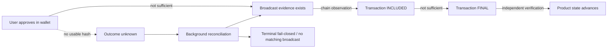

# Approval Is Not Final

> A reusable integration pattern for wallet-driven applications where user approval, transaction broadcast, chain inclusion, and finality are separate facts.

NimCarry learned this pattern through real Nimiq TESTNET runs on iOS. It is now a product and engineering invariant:

**approval ≠ broadcast ≠ INCLUDED ≠ FINAL**

The distinction matters because a wallet UI can complete its approval step while the calling application still lacks enough evidence to know whether a transaction was actually broadcast, included, or finalized.

This document explains the failure modes we observed, the safety model we adopted, and the implementation changes that made the product resilient without asking users to resend blindly.

## The core state model



The application must never collapse these states into one boolean such as `paymentSucceeded = true`.

A safer model is:

| State | What it proves | What it does **not** prove |
|---|---|---|
| Approval | The user approved the wallet action | Broadcast, inclusion, finality |
| Broadcast evidence | A specific transaction can be identified | Inclusion or finality |
| INCLUDED | The transaction is observed on-chain | Irreversible completion |
| FINAL | The transaction satisfies the application's finality rule | Human acknowledgement or downstream business completion |
| Product advancement | The application has accepted FINAL as sufficient evidence | Anything beyond the product rule itself |

For NimCarry, only independently verified **FINAL** can advance financial delivery.

## Why this became necessary

During controlled Nimiq Pay 2.19.1 TESTNET testing on iOS, NimCarry observed more than one path after wallet approval.

### Path A — approval, no usable hash, later recovered

A Destination Claim mission reached Nimiq Pay approval, but the client received no provable transaction hash.

At that moment NimCarry knew only:

```
approval happened
→ no durable/provable tx hash returned
→ broadcast could not be proven
→ payment outcome remained unknown
```

The UI therefore told the user **not to resend**.

Later, the background reconciler independently discovered the original transaction:

- transaction: `393e98c2cb9db0bf9bc5f40dca835f76f43262630d4bfc0a326aea02286b596e`
- INCLUDED: `2026-09-21T10:50:16.621Z`
- FINAL: `2026-09-21T10:51:02.963Z`
- no second payment was required

The important lesson is not that every no-hash approval has broadcast. The lesson is the opposite:

**when the client cannot prove broadcast, the outcome is unknown until independent evidence resolves it.**

### Path B — approval, no usable hash, no matching broadcast found

Another controlled attempt also returned from the approval path without a provable transaction hash.

Background recovery later reached a terminal fail-closed outcome:

- no transaction hash was discovered;
- no matching broadcast was proven;
- no FINAL existed;
- custody/product state did not advance;
- no second payment was sent.

The same client-visible symptom — “approval happened, but no hash came back” — therefore produced two different eventual truths.

That is exactly why approval cannot be treated as payment success or payment failure.

### Path C — hash observed, client closes before FINAL, backend finishes

In a separate real TESTNET run, a transaction was recorded, the sender closed the client before FINAL, and server-owned reconciliation continued independently.

The mission reached FINAL and ARRIVED without:

- keeping the browser open;
- pressing a manual recheck button;
- recreating the mission;
- sending another payment.

This established another rule:

**finality is a backend responsibility, not a browser-lifetime responsibility.**

## The safety contract

NimCarry now applies these rules to every payment attempt:

1. **Approval never advances custody or financial delivery.**
2. **A missing client hash is an ambiguous state, not a failure verdict.**
3. **The user must not be asked to resend while an earlier payment could still exist.**
4. **Reconciliation must be automatic, durable, idempotent, and independent of the browser.**
5. **INCLUDED is evidence of chain inclusion, not application finality.**
6. **Only independently verified FINAL advances the financial state.**
7. **If no matching broadcast is found and the attempt expires safely, the flow terminates fail-closed without custody movement.**
8. **Restarting, reopening, retrying, or reconciling must never create a duplicate-payment path.**
9. **A durable FINAL that outlives a failed projection must be repairable without another payment.**

## What changed in NimCarry

The resilience work happened in several steps.

### PR #114 — background FINAL reconciliation

Long-running finality verification moved out of the browser and into the server maintenance loop.

The browser no longer owns the truth simply because it initiated the wallet action.

### PR #117 — ambiguous no-hash submissions

When Nimiq Pay returns without a provable hash, NimCarry no longer repeatedly polls from the foreground or encourages a resend.

The existing attempt is handed to background reconciliation.

### PR #119 — safe close/reopen recovery

A user can fully close the mini-app and later rediscover the same mission without persisting private route-view bearer capabilities.

Reopening restores read access; it does not create another payment authorization.

### PR #122 — stranded FINAL projection repair

A crash/race window revealed that a relay hop could become durably FINAL while the mission projection remained behind.

Background/startup reconciliation now rescans durable FINAL rows and repairs the mission projection idempotently.

This closes a dangerous presentation gap where a product could otherwise show both a FINAL payment and another Send action.

## Reference integration algorithm

A wallet-integrated application can implement the same pattern without copying NimCarry's product model.

```text
1. Create one durable payment intent with an idempotency identity.

2. Ask the wallet for explicit user approval.

3. If a usable transaction hash is returned:
     record it against the existing intent
   else:
     mark the attempt as ambiguous / awaiting discovery
     DO NOT mark failed
     DO NOT create another send

4. Reconcile independently:
     a. discover the exact matching transaction if necessary
     b. verify sender / recipient / amount / payload / network
     c. observe chain status

5. If INCLUDED:
     keep waiting

6. If FINAL:
     atomically project the application state forward
     make every repeated reconciliation call a no-op

7. If the attempt can be proven stale with no matching broadcast:
     terminate fail-closed
     allow a new intent only under an explicit safe-retry rule

8. On process restart:
     rescan unresolved intents
     rescan durable FINALs whose application projection may be incomplete
```

The most important implementation detail is step 7: **retry eligibility is a security rule, not merely a UX decision.**

## Evidence boundary

This write-up describes behavior observed by NimCarry and the mitigations implemented in NimCarry.

It does **not** claim that Nimiq has confirmed a root cause.

The wallet-side investigation is tracked publicly in:

- [nimiq/wallet issue #314 — Nimiq Pay 2.19.1 TESTNET: intermittent post-approval submission with no provable transaction hash on iOS](https://github.com/nimiq/wallet/issues/314)

NimCarry does not have the raw internal Nimiq Pay logs from the original failing approval attempts. The available evidence consists of:

- controlled TESTNET screen recordings and screenshots;
- exact NimCarry-side states and errors;
- durable intent/hop state;
- independent chain observations;
- failing-state versus passing-state behavior.

That evidence is sufficient to define a safe application contract, but not to attribute the wallet-side root cause.

## Why this pattern generalizes

Any wallet-integrated product can hit an uncertainty boundary between **human approval** and **independent settlement evidence**.

The same design principle applies to:

- mobile wallet deep links;
- embedded wallet SDKs;
- mini-app providers;
- browser-to-wallet handoffs;
- flaky network returns;
- application restarts after submission;
- RPC disagreement or delayed indexing.

The product should preserve uncertainty rather than manufacture certainty.

A useful mental model is:

> **The wallet tells you what the user approved.  
> The chain tells you what happened.  
> Your application decides what FINAL means for product state.**

Those are three different responsibilities.

## Related NimCarry evidence

- [Destination Claim first real TESTNET run](evidence/DESTINATION-CLAIM-LIVE-2026-09-21.md)
- [Architecture](ARCHITECTURE.md)
- [Security model](../SECURITY.md)
- [Nimiq wallet issue #314](https://github.com/nimiq/wallet/issues/314)
