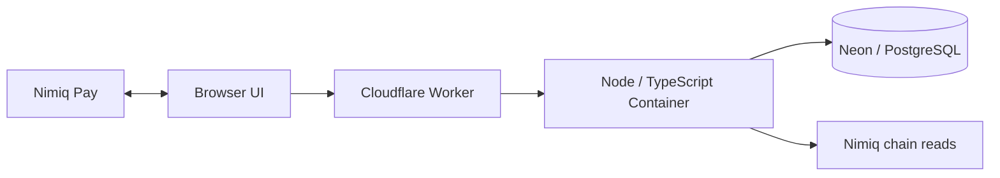

# NimCarry architecture

NimCarry is a destination-bound human routing Mini App. Exactly 1 NIM acts as the custody baton for each handoff, and custody changes only after independently verified finality.

## Runtime

### Browser

The browser handles the five-screen product flow, Nimiq Pay session access, explicit wallet approval, scoped route-view capability storage, and demo-only presentation states.

### Cloudflare

The Worker serves static assets and routes mission/API requests to the canonical Node runtime inside a single Cloudflare Container identity.

### Mission service

The backend owns mission, invitation, authorization, pass-intent, broadcast-claim, reconciliation, and finality rules. Browser claims are never authoritative custody evidence.

### PostgreSQL

Neon/PostgreSQL stores durable mission state, invitations, pass intents, participants, audit events, and finalized hops. Database constraints enforce mission/sequence uniqueness and concurrency boundaries.

### Nimiq verification

Wallet approval is user intent, not proof. NimCarry independently verifies chain evidence before moving custody. The state model deliberately distinguishes approval, broadcast, pending, FINAL, and ARRIVED.

## Core security boundaries

- Known destination required for every mission.
- Explicit bridge consent before payment.
- Exactly `100000` Luna per baton handoff; requested fee `0`.
- Opaque `co:v1:` transaction commitment instead of clear-text mission identifiers.
- Encrypted destination storage with keyed matching for arrival.
- Scoped route-view and one-time broadcast capabilities.
- No route reuse by a finalized wallet.
- No reroute/cancel after broadcast evidence.
- Only verified FINAL changes custody.

## Production origin

`https://nimcarry.faadil-casecraft.workers.dev`

The current public release is a Cycle II Public Preview. Mainnet is disabled and real A→B→C TESTNET proof remains pending while the Nimiq Pay post-approval submission issue is investigated.
